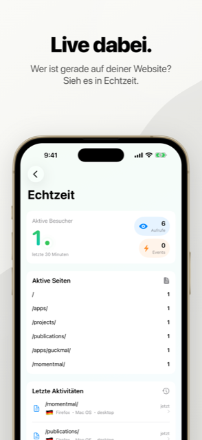
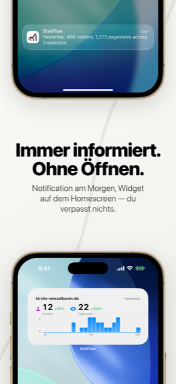

<p align="center">
  
</p>

<h1 align="center">StatFlow</h1>

<p align="center">
  Die iPhone-App für <a href="https://umami.is">Umami</a> und <a href="https://plausible.io">Plausible</a> —<br>
  die Zahlen der eigenen Websites, ohne Umweg über den Browser.
</p>

<p align="center">
  
  
  
  
</p>

## Worum es geht

Umami und Plausible zählen Besuche, ohne ihre Besucher:innen zu verfolgen. Beide
haben ein Dashboard im Browser — auf dem Handy ist das mühsam.

StatFlow holt dieselben Zahlen auf den Sperrbildschirm: Wie läuft die Website
heute, woher kommen die Leute, was lesen sie. Mehrere Konten und beide Anbieter
nebeneinander, in einer App. Die Zugangsdaten bleiben im Schlüsselbund des
Geräts, die Daten auf dem eigenen Server — es gibt keinen Dienst dazwischen.

## Funktionen

- **Übersicht** — Besuche, Aufrufe, Absprungrate und Verweildauer, auch in Echtzeit
- **Auswertungen** — Seiten, Verweise, Länder, Geräte, Browser und eigene Ereignisse
- **Vergleiche** — beliebige Zeiträume gegeneinander, Woche gegen Woche, Jahr gegen Jahr
- **Vermerke** — Notizen im Verlauf („Newsletter verschickt", „Relaunch"), die im
  Nachhinein erklären, warum die Zahlen ausschlagen
- **Widgets** — die wichtigsten Zahlen auf dem Home-Bildschirm
- **Mitteilungen** — Zusammenfassung täglich oder wöchentlich
- **Ohne Netz** — zuletzt geladene Zahlen bleiben lesbar
- **Mehrere Konten** — verschiedene Anbieter und Instanzen nebeneinander
- Deutsch und Englisch, Hell und Dunkel

## Installation

**[Im App Store laden »](https://apps.apple.com/app/id6761671122)**

> Im App Store heißt die App **StatsFlow** — *StatFlow* war dort schon vergeben.
> Im Quelltext und in der Dokumentation heißt sie weiter StatFlow, der
> Xcode-Zielname `InsightFlow` stammt noch aus der Anfangszeit.

Zum Loslegen braucht es ein Konto bei Umami oder Plausible: in der App die
Adresse des Servers und die Zugangsdaten eintragen, Websites auswählen, fertig.

## Welche Server passen

| Anbieter | Nötig | Zuletzt geprüft gegen |
|----------|-------|-----------------------|
| **Umami** | ab 3.0, selbst betrieben oder Cloud | 3.3.0 und 3.4.0 |
| **Plausible** | ab CE 2.1 oder Cloud | CE 3.2.1 |

Umami 2.x antwortet in einem anderen Format und wird nicht unterstützt. Einige
Auswertungen setzen neuere Stände voraus — Vermerke und die Anmeldung per
API-Schlüssel etwa Umami 3.4. Die App erkennt selbst, was ein Server kann, und
blendet den Rest aus.

Was bei welchem Anbieter geht und woran es liegt, steht in
[docs/kompatibilitaet.md](docs/kompatibilitaet.md).

## Bildschirmfotos

| Übersicht | Website |
|-----------|---------|
|  |  |

| Echtzeit | Widgets und Mitteilungen |
|----------|--------------------------|
|  |  |

## Versionen

Was sich wann geändert hat, steht in [CHANGELOG.md](CHANGELOG.md) — nach
[Keep a Changelog](https://keepachangelog.com/de/1.1.0/), aus Sicht der
Nutzer:innen geschrieben. Die
[Releases](https://github.com/Revisor01/StatFlow/releases) fassen jede Version
zusammen.

## Selbst bauen

```bash
git clone https://github.com/Revisor01/StatFlow.git
cd StatFlow
open InsightFlow.xcodeproj
```

Xcode 16 oder neuer, Ziel ist iOS 18. In den Signierungs-Einstellungen das
eigene Team eintragen, dann auf Gerät oder Simulator starten. Die App kommt
ohne fremde Bibliotheken aus, es gibt nichts nachzuladen.

## Aufbau

```
StatFlow
├── InsightFlow/
│   ├── Views/          — SwiftUI nach Bereich: Dashboard, Detail,
│   │                     Reports, Events, Realtime, Settings …
│   │                     das ViewModel liegt jeweils daneben
│   ├── Services/       — UmamiAPI und PlausibleAPI als Actors,
│   │                     Konten, Schlüsselbund, Zwischenspeicher
│   └── Models/         — Antworten der APIs, anbieterunabhängig
├── InsightFlowWidget/  — Home-Bildschirm-Widgets
├── InsightFlowTests/   — 126 Tests
└── docs/
```

**Worauf es beim Bauen ankommt:**
- **Ein Protokoll für beide Anbieter.** `AnalyticsProvider` verdeckt die
  Unterschiede zwischen Umami und Plausible; die ViewModels wissen nicht,
  womit sie gerade reden.
- **Zugangsdaten gehören in den Schlüsselbund**, je Konto getrennt — nie in
  die Einstellungen.
- **Keine fremden Bibliotheken.** Nur was Apple mitliefert.
- **Ältere Server dürfen nicht brechen.** Neue Auswertungen werden geprüft
  und bei Bedarf ausgeblendet, statt einen Fehler zu zeigen.

## Mitmachen

Fehlermeldungen und Vorschläge sind willkommen — gern als
[Issue](https://github.com/Revisor01/StatFlow/issues).

## Datenschutz

StatFlow sammelt nichts. Keine Analyse, keine Werbung, keine fremden
Bausteine, kein Server dazwischen. Die App spricht ausschließlich mit den
Instanzen, die man selbst einträgt; Zugangsdaten liegen im Schlüsselbund des
Geräts und verschwinden mit der App.

Die vollständige Erklärung steht unter
[simonluthe.de/apps/statsflow/datenschutz](https://simonluthe.de/apps/statsflow/datenschutz/).

## Lizenz

StatFlow steht unter der [GNU General Public License v3.0](LICENSE).

## Hinweis

Eine App von außen, kein offizielles Produkt: StatFlow gehört weder zu Umami
Software, Inc. noch zu Plausible Insights OÜ und wird von beiden nicht
unterstützt.

Dank an [Umami](https://umami.is) und [Plausible](https://plausible.io) dafür,
dass es datenschutzfreundliche Analytik überhaupt gibt.

## Kontakt

Pastor Simon Luthe · [mail@simonluthe.de](mailto:mail@simonluthe.de) ·
[simonluthe.de](https://simonluthe.de)
